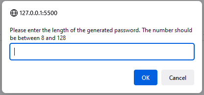
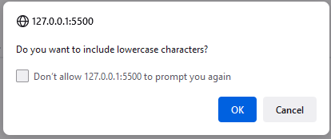
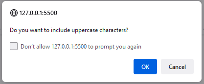
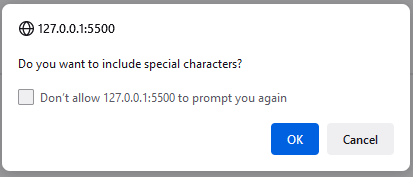
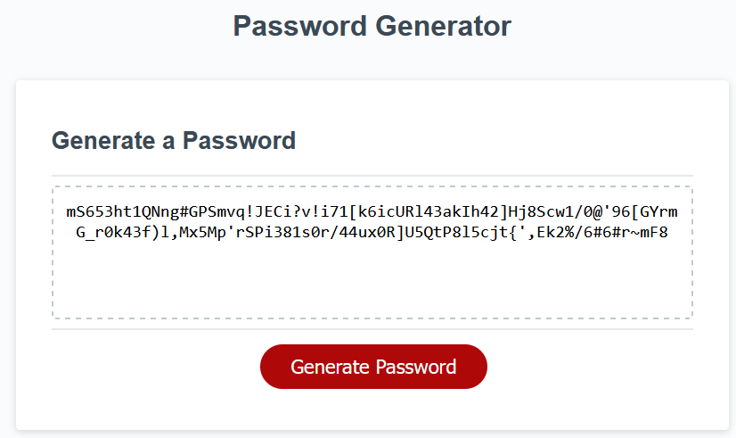

# Bootcamp Module5 Challenge - Password generator

## Description
This small web application generates a random password based on criteria the user selected.

## Criteria
* Generate a password when the button is clicked
  * Present a series of prompts for password criteria
    * Length of password
      * At least 8 characters but no more than 128.
    * Character types
      * Lowercase
      * Uppercase
      * Numeric
      * Special characters ($@%&*, etc)
* Code validates for each input and at least one character type should be selected
* Once prompts are answered then the password is generated and written to the page

## Live URL
https://laszlosomogyimusic.github.io/bootcamp-module5-challenge/

## Usage
1. On the welcome page click on Generate Password button

2. First asks for the password length. Please enter a number between 8 and 128. If you entered a wrong number you can't carry on

3. Then ask whether the password should contain lowercase characters

4. Then ask whether the password should contain uppercase characters

5. Then ask whether the password should contain numeric characters

6. Then ask whether the password should contain special characters

7. The generated password is ready

